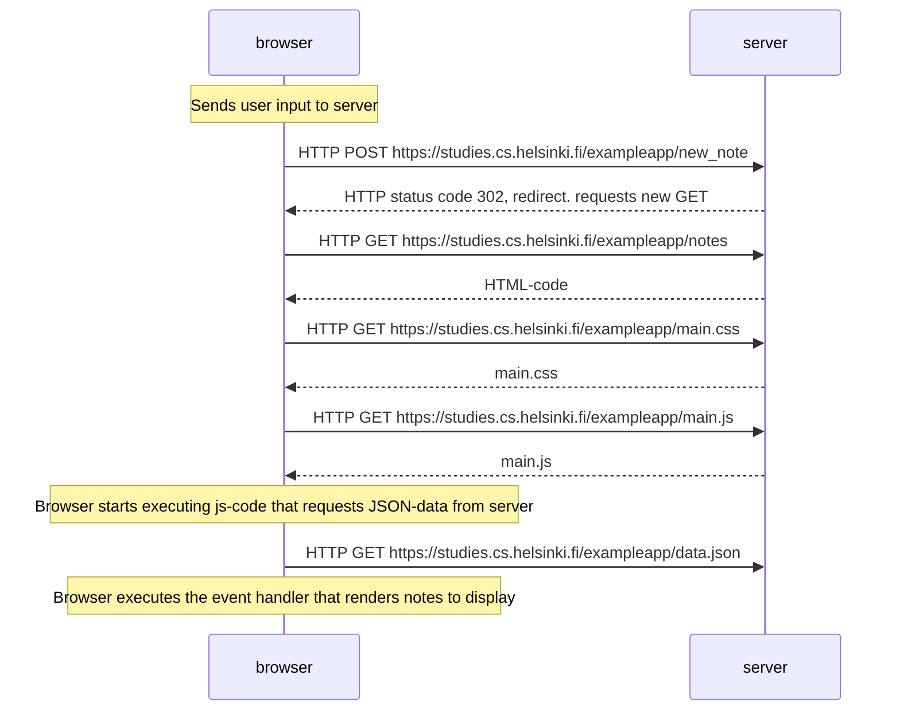

# Excercise 0.4 - New Note Diagram

```mermaid
sequenceDiagram
    note over browser: Sends user input to server
    browser->>server: HTTP POST https://studies.cs.helsinki.fi/exampleapp/new_note
    server-->>browser: HTTP status code 302, redirect. requests new GET
    browser->>server: HTTP GET https://studies.cs.helsinki.fi/exampleapp/notes
    server-->>browser: HTML-code
    browser->>server: HTTP GET https://studies.cs.helsinki.fi/exampleapp/main.css
    server-->>browser: main.css
    browser->>server: HTTP GET https://studies.cs.helsinki.fi/exampleapp/main.js
    server-->>browser: main.js
    note over browser: Browser starts executing js-code that requests JSON-data from server
    browser->>server: HTTP GET https://studies.cs.helsinki.fi/exampleapp/data.json
    note over browser: Browser executes the event handler that renders notes to display
```

[[Home]](../../README.md)
