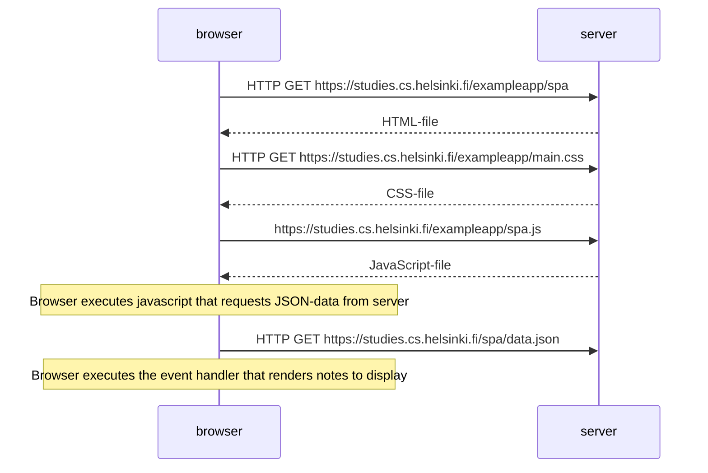

# 0.5 - Single Page App Diagram
Works the same way as the exampleapp, but contains different javascript.
No change before a new note is created.

```mermaid
sequenceDiagram
    browser->>server: HTTP GET https://studies.cs.helsinki.fi/exampleapp/spa
    server-->>browser: HTML-file
    browser->>server: HTTP GET https://studies.cs.helsinki.fi/exampleapp/main.css
    server-->>browser: CSS-file
    browser->>server: https://studies.cs.helsinki.fi/exampleapp/spa.js
    server-->>browser: JavaScript-file
    note over browser: Browser executes javascript that requests JSON-data from server
    browser->>server: HTTP GET https://studies.cs.helsinki.fi/spa/data.json
    note over browser: Browser executes the event handler that renders notes to display
```

[[Home]](../../README.md)
