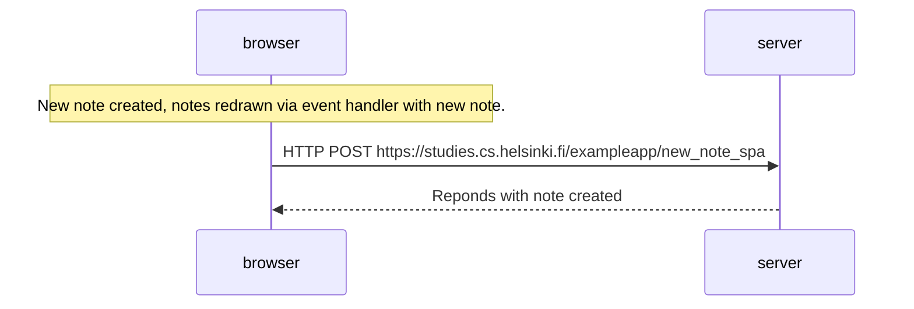

# 0.6 - New Note in Single App Diagram

```mermaid
sequenceDiagram
    note over browser: New note created, notes redrawn via event handler with new note.
    browser->>server: HTTP POST https://studies.cs.helsinki.fi/exampleapp/new_note_spa
    server-->>browser: Reponds with note created
```
